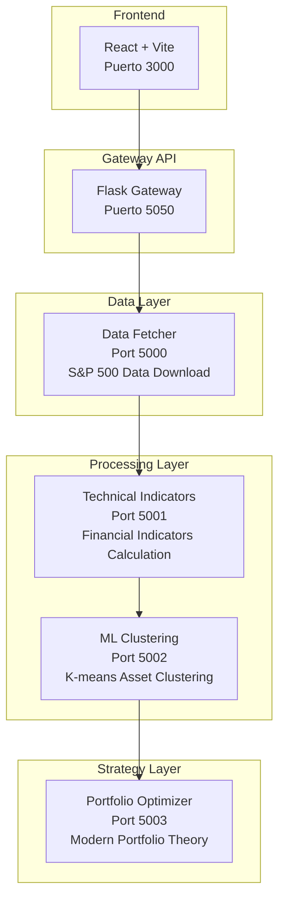

# Financial Data Processing Microservices

## Descripción General

Sistema distribuido de microservicios para el procesamiento y análisis de datos financieros del S&P 500, construido con **Ray** para computación paralela de alta performance. El sistema implementa un pipeline completo desde la descarga de datos hasta la optimización de portafolios de inversión.

##  Arquitectura del Sistema



##  Flujo de Datos

1. **Frontend** → Interfaz web desarrollada en React + Vite que permite al usuario interactuar con el sistema de análisis financiero de forma visual e intuitiva.
2. **API Gateway** → Microservicio en Flask (puerto 5050) que centraliza y redirige las peticiones del frontend hacia los microservicios adecuados.
3. **Data Fetcher** → Descarga datos históricos del S&P 500 desde Yahoo Finance
4. **Technical Indicators** → Calcula indicadores técnicos (RSI, Bollinger Bands, MACD, etc.)
5. **ML Clustering** → Aplica K-means clustering y calcula factores Fama-French
6. **Portfolio Optimizer** → Optimiza portafolios usando Modern Portfolio Theory

##  Stack Tecnológico

- **Framework**: Flask
- **Paralelización**: Ray (Distributed Computing)
- **ML/Analytics**: scikit-learn, pandas, numpy
- **Finance**: yfinance, pandas-ta, pypfopt, statsmodels
- **Data**: pandas, pandas-datareader

---

##  Microservicios y Endpoints

###  **Microservicio 0: Data Fetcher** (Puerto 5000)

**Función**: Descarga de datos históricos del S&P 500

| Método | Endpoint | Descripción | Paralelización |
|--------|----------|-------------|----------------|
| `POST` | `/sp500_data` | Descarga paralela de datos S&P 500 |  Ray |
| `POST` | `/sp500_data_original` | Descarga secuencial (comparación) |  Secuencial |
| `POST` | `/compare` | Comparación entre métodos |  Ambos |
| `GET` | `/status` | Estado del servicio y Ray cluster |  Info |

**Features**:
- Descarga paralela por chunks de símbolos
- Manejo automático de errores de símbolos
- Optimización de memoria y performance
- Datos de 8 años de historial

---

###  **Microservicio 1: Technical Indicators** (Puerto 5001)

**Función**: Cálculo de indicadores técnicos financieros

| Método | Endpoint | Descripción | Paralelización |
|--------|----------|-------------|----------------|
| `POST` | `/getData` | Cálculo paralelo de indicadores |  Ray |
| `POST` | `/getDataSequential` | Cálculo secuencial |  Secuencial |
| `POST` | `/comparePerformance` | Benchmark paralelo vs secuencial |  Comparación |
| `GET` | `/status` | Estado del servicio |  Info |

**Indicadores Calculados**:
- **Garman-Klass Volatility**: Volatilidad intraday
- **RSI**: Relative Strength Index (20 períodos)
- **Bollinger Bands**: Bandas superior, media e inferior
- **ATR**: Average True Range normalizado
- **MACD**: Moving Average Convergence Divergence
- **Dollar Volume**: Volumen en millones de dólares

---

###  **Microservicio 2: ML Clustering** (Puerto 5002)

**Función**: Clustering de activos y análisis de factores

| Método | Endpoint | Descripción | Paralelización |
|--------|----------|-------------|----------------|
| `POST` | `/Kmeans-getData` | Clustering paralelo con K-means |  Ray |
| `POST` | `/Kmeans-getDataSequential` | Clustering secuencial |  Secuencial |
| `POST` | `/comparePerformance` | Benchmark de performance |  Comparación |
| `GET` | `/status` | Estado del servicio |  Info |

**Características**:
- **K-means**: 4 clusters con centroides inicializados por RSI
- **Factores Fama-French**: 5 factores (Mkt-RF, SMB, HML, RMW, CMA)
- **Rolling Betas**: Ventana de 24 meses, mínimo 12 observaciones
- **Returns**: Cálculo de retornos a 1, 2, 3, 6, 9 y 12 meses

---

###  **Microservicio 3: Portfolio Optimizer** (Puerto 5003)

**Función**: Optimización de portafolios de inversión

| Método | Endpoint | Descripción | Paralelización |
|--------|----------|-------------|----------------|
| `POST` | `/getResult` | Optimización paralela de portafolios |  Ray |
| `POST` | `/getResultSequential` | Optimización secuencial |  Secuencial |
| `POST` | `/comparePerformance` | Benchmark de optimización |  Comparación |
| `GET` | `/status` | Estado del servicio |  Info |

**Estrategia de Optimización**:
- **Selección**: Activos del cluster 3 (sobreventa/oportunidad)
- **Método**: Maximización del ratio Sharpe
- **Restricciones**: Peso máximo 10% por activo
- **Fallback**: Pesos iguales si la optimización falla
- **Rebalanceo**: Mensual con datos de 12 meses

---

##  Instalación y Configuración

### Requisitos Previos

```bash
Python 3.8+
pip install -r requirements.txt
```

### Dependencias Principales

```txt
ray>=2.0.0
flask>=2.0.0
pandas>=1.3.0
numpy>=1.21.0
yfinance>=0.1.87
pandas-ta>=0.3.14b
pypfopt>=1.5.0
scikit-learn>=1.0.0
statsmodels>=0.13.0
pandas-datareader>=0.10.0
```

### Ejecución

```bash
# Terminal 1 - Data Fetcher
python microservice_0_data_fetcher.py

# Terminal 2 - Technical Indicators  
python microservice_1_indicators.py

# Terminal 3 - ML Clustering
python microservice_2_clustering.py

# Terminal 4 - Portfolio Optimizer
python microservice_3_portfolio.py
```

---

### Flujo Completo

```bash
# 1. Obtener datos del S&P 500
curl -X POST http://localhost:5000/sp500_data

# 2. Calcular indicadores técnicos
curl -X POST http://localhost:5001/getData

# 3. Aplicar clustering ML
curl -X POST http://localhost:5002/Kmeans-getData

# 4. Optimizar portafolio
curl -X POST http://localhost:5003/getResult
```

### Comparación de Performance

```bash
# Comparar performance en cada microservicio
curl -X POST http://localhost:5000/compare
curl -X POST http://localhost:5001/comparePerformance
curl -X POST http://localhost:5002/comparePerformance  
curl -X POST http://localhost:5003/comparePerformance
```

### Monitoreo del Sistema

```bash
# Verificar estado de todos los servicios
curl -X GET http://localhost:5000/status
curl -X GET http://localhost:5001/status
curl -X GET http://localhost:5002/status
curl -X GET http://localhost:5003/status
curl -X GET http://localhost:5050/api/status
```

---

